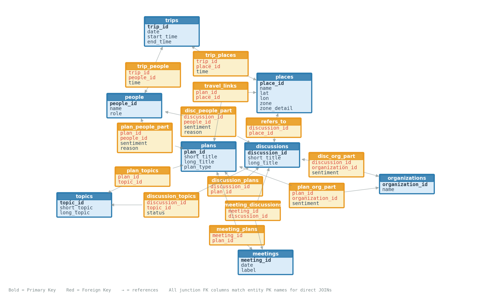

# COOTEFOO Board Investigation Dashboard

VAST Challenge 2025 MC2 — Interactive investigation of the Commission on Overseeing the Economic Future of Oceanus.

```bash
uv run marimo run index.py
```

## Background

Oceanus has enjoyed a relatively simple, fishing-based economy for decades. Tourism has recently expanded and created tension. The local government set up COOTEFOO to monitor the economy and advise on the future.

Two lobby groups accuse the board of opposite biases:

- **FILAH** (Fishing is Living and Heritage) claims the board favors tourism and neglects the fishing industry.
- **TROUT** (Tourism Raises OceanUs Together) claims the board appeases entrenched fishing interests and ignores growth opportunities.

Two independent data sources document the board's activities: government records (13 meetings) and journalist records (16 meetings). The government dataset is a strict subset of the journalist data. Shared rows match exactly; the difference is coverage gaps.

## Dashboards

Four interactive dashboards, accessible via tabs in a single marimo app:

| Tab | Dashboard | Question |
|-----|-----------|----------|
| 1 | Sentiment Map | How do members' sentiments align across fishing and tourism topics? |
| 2 | Visit Map | Where do members travel, and do they favor industrial or tourism zones? |
| 3 | Participation | How much activity does each person drive across topics? |
| 4 | The Committee | Who said what, who agrees with whom, and where did they actually go to look? |

## Data

| Source | Meetings | Discussions | Plans | Trips | Places |
|--------|----------|-------------|-------|-------|--------|
| Government | 13 | 75 | 55 | 194 | 93 |
| Journalist | 16 | 101 | 74 | 342 | 172 |

Six board members. Eight organizations. Fifteen topics spanning fishing infrastructure, tourism, housing, and community development. Entity tables (people, organizations, topics) are identical across both sources.

### Schema



### Sources

- `data/Collected_by_the_Government/` — 18 CSV files
- `data/Collected_by_the_Journalist/` — 18 CSV files
- `data/cleaned_data/` — Merged/normalized tables
- `data/*.json`, `data/*.geojson` — Pre-computed data for dashboards 1-3

## Personas

**Elena Petrova** (pro-fishing, FILAH) — Wants visual evidence of whether fishing is neglected or treated unfairly compared with tourism.

**Lucas Moreau** (pro-tourism, TROUT) — Wants visual summaries revealing whether the board is holding back change by favoring fishing over tourism.

**Marta Kowalska** (journalist) — Wants evidence-based patterns, inconsistencies, and conflicts of interest to communicate a balanced story.

## Setup

Requires Python 3.13+ and [uv](https://docs.astral.sh/uv/).

```bash
# Run all 6 dashboards in tabs
uv run marimo run index.py

# Edit mode
uv run marimo edit index.py
```

See [onboard.md](onboard.md) for a per-dashboard interaction guide.
